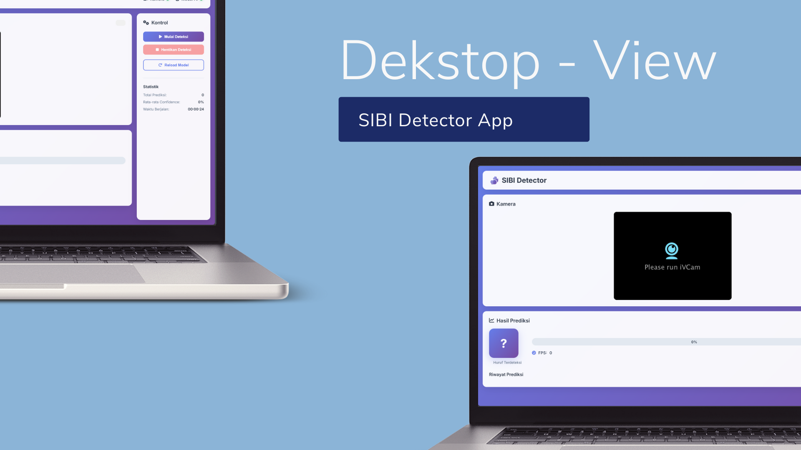
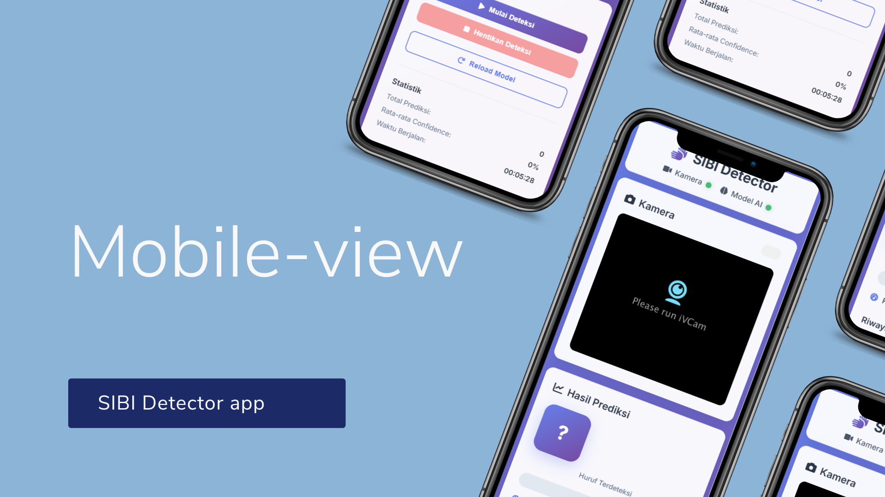
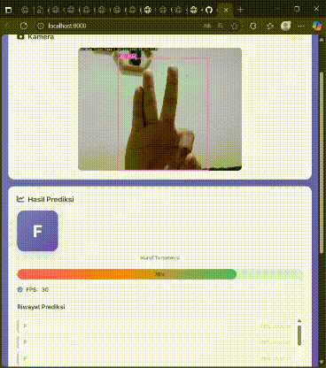

<div align="center">

# 🤟 Sign Language Detection App

### Real-time AI-Powered Sign Language Recognition

[](https://www.python.org/)
[](https://flask.palletsprojects.com/)
[](https://github.com/ultralytics/ultralytics)
[](https://opencv.org/)
[](LICENSE)


[📖 Documentation](#-instalasi-manual) · [🚀 Quick Start](#-cara-cepat-menjalankan-aplikasi) · [🐛 Report Bug](mailto:ahmadal2404@gmail.com) · [✨ Request Feature](mailto:ahmadal2404@gmail.com)

</div>

---

## 📸 Preview

<div align="center">

### 💻 Desktop View


### 📱 Mobile View


### 🎯 Detection in Action


</div>

---

## ✨ Fitur Utama

<table>
<tr>
<td width="50%">

### 🎥 **Real-time Streaming**
Tampilan kamera langsung dengan latensi minimal di browser

### 🧠 **AI Detection**
Model YOLO yang akurat untuk mendeteksi huruf isyarat

### 📊 **Live Statistics**
Confidence score, FPS counter, dan riwayat prediksi

</td>
<td width="50%">

### 🎛️ **Full Control**
Pemilihan kamera, start/stop, dan reload model

### 📱 **Responsive Design**
Kompatibel dengan desktop, tablet, dan mobile

### 🔔 **Smart Notifications**
Toast notifications untuk feedback real-time

</td>
</tr>
</table>

---

## 🛠️ Tech Stack

<div align="center">

| Backend | Frontend | AI/ML | Tools |
|---------|----------|-------|-------|
|  |  |  |  |
|  |  |  |  |
|  |  |  |  |

</div>

---

## 📁 Struktur Project

```
sign-language-app/
├── 📂 backend/
│   ├── 🐍 app.py              # Flask backend server
│   ├── 📦 requirements.txt    # Python dependencies
│   ├── 🤖 best.pt            # Model YOLO
│   └── 🧪 test_api.py        # API testing
├── 📂 frontend/
│   ├── 📄 index.html         # Main HTML file
│   ├── 🎨 styles.css         # Styling
│   └── ⚡ script.js          # JavaScript logic
├── 📂 assets/                # Screenshots & demos
├── 📜 README.md
├── 🚀 run.bat               # Windows launcher
└── 🚀 run.sh                # Linux/Mac launcher
```

---

## 🚀 Cara Cepat Menjalankan Aplikasi

### 🪟 Untuk Windows (Termudah)

```bash
1️⃣ Copy file best.pt ke folder backend/
2️⃣ Double-click run.bat
3️⃣ Aplikasi otomatis terbuka di browser! 🎉
```

### 🐧 Untuk Linux/Mac

```bash
# Copy model
cp /path/to/your/best.pt backend/

# Jalankan aplikasi
chmod +x run.sh
./run.sh
```

---

## 📖 Instalasi Manual

### 1️⃣ Setup Backend

```bash
# Masuk ke folder backend
cd backend

# Buat virtual environment
python -m venv venv

# Aktifkan virtual environment
# Windows:
venv\Scripts\activate
# Linux/Mac:
source venv/bin/activate

# Install dependencies
pip install -r requirements.txt

# Copy model YOLO
# Pastikan best.pt ada di folder backend/

# Jalankan server
python app.py
```

> ✅ Backend berjalan di `http://localhost:5000`

### 2️⃣ Setup Frontend

```bash
# Masuk ke folder frontend
cd frontend

# Jalankan HTTP server
python -m http.server 8000

# Atau buka langsung index.html di browser
```

> ✅ Frontend berjalan di `http://localhost:8000`

---

## 🎮 Cara Penggunaan

<div align="center">

| Langkah | Aksi | Deskripsi |
|---------|------|-----------|
| 1️⃣ | **Pilih Kamera** | Gunakan dropdown untuk memilih kamera |
| 2️⃣ | **Mulai Deteksi** | Klik tombol "Start Detection" |
| 3️⃣ | **Lakukan Gestur** | Tunjukkan huruf bahasa isyarat |
| 4️⃣ | **Lihat Hasil** | Prediksi muncul real-time dengan confidence |
| 5️⃣ | **Stop/Reload** | Kontrol deteksi sesuai kebutuhan |

</div>

---

## 🔧 Konfigurasi

### ⚙️ Backend Settings (`app.py`)

```python
# Model Configuration
WEIGHTS_PATH = "best.pt"           # Path model YOLO
CONFIDENCE_THRESHOLD = 0.25        # Ambang batas confidence
IMG_SIZE = 640                     # Ukuran input gambar
```

### ⚙️ Konfigurasi Kamera

```python
# Untuk kamera internal laptop/PC
CAMERA_URL = 0  # Ganti: 0, 1, 2, dst

# Untuk DroidCam atau kamera eksternal
CAMERA_URL = "http://192.168.1.10:4747/video"
```

---

## 🐛 Troubleshooting

<details>
<summary><b>❌ Kamera Tidak Terdeteksi</b></summary>

- ✅ Pastikan kamera tidak digunakan aplikasi lain
- ✅ Cek permission kamera di browser
- ✅ Coba ganti index kamera (0, 1, 2, 3)
- ✅ Untuk kamera internal, gunakan `CAMERA_URL = 0`

</details>

<details>
<summary><b>❌ Model Tidak Terload</b></summary>

- ✅ Pastikan `best.pt` ada di folder `backend/`
- ✅ Cek path model di `app.py`
- ✅ Restart server setelah copy model
- ✅ Pastikan file tidak corrupt

</details>

<details>
<summary><b>❌ Video Feed Error</b></summary>

- ✅ Pastikan backend berjalan di port 5000
- ✅ Cek firewall/antivirus
- ✅ Pastikan port tidak digunakan aplikasi lain
- ✅ Coba restart browser

</details>

<details>
<summary><b>⚠️ Performance Issues</b></summary>

- ✅ Kurangi resolusi kamera
- ✅ Pastikan GPU tersedia untuk YOLO
- ✅ Tutup aplikasi lain yang menggunakan kamera
- ✅ Update driver GPU

</details>

---

## 📊 API Documentation

### 🔌 Endpoints

| Method | Endpoint | Deskripsi |
|--------|----------|-----------|
| `GET` | `/` | Status server |
| `GET` | `/api/camera/status` | Status kamera dan model |
| `POST` | `/api/camera/set_index` | Set index kamera |
| `GET` | `/api/prediction` | Prediksi saat ini |
| `GET` | `/api/cameras/list` | Daftar kamera tersedia |
| `GET` | `/video_feed` | MJPEG video stream |
| `GET` | `/api/model/reload` | Reload model YOLO |

---

## 🚀 Roadmap & Future Features

- [ ] 📹 **Video Recording** - Simpan sesi deteksi
- [ ] 📚 **Dataset Training** - Interface untuk training data baru
- [ ] 🤲 **Multi-hand Detection** - Deteksi dua tangan sekaligus
- [ ] 📱 **Mobile App** - Native mobile dengan React Native
- [ ] ☁️ **Cloud Deployment** - Deploy ke AWS/GCP/Azure
- [ ] 🌐 **Multi-language Support** - Support bahasa lain
- [ ] 📈 **Analytics Dashboard** - Statistik penggunaan detail
- [ ] 🎯 **Gesture Recognition** - Deteksi kata/kalimat lengkap

---

## 🤝 Contributing

Kontribusi sangat diterima! Ikuti langkah berikut:

1. 🍴 Fork project ini
2. 🌿 Buat branch fitur (`git checkout -b feature/AmazingFeature`)
3. 💾 Commit perubahan (`git commit -m 'Add some AmazingFeature'`)
4. 📤 Push ke branch (`git push origin feature/AmazingFeature`)
5. 🎉 Buat Pull Request

---

## 📄 License

Distributed under the MIT License. See `LICENSE` for more information.

---

## 📧 Contact

**Ahmad Al**

📧 Email: [ahmadal2404@gmail.com](mailto:ahmadal2404@gmail.com)

🔗 Project Link: [Sign Language Detection](https://github.com/yourusername/sign-language-app)

---
